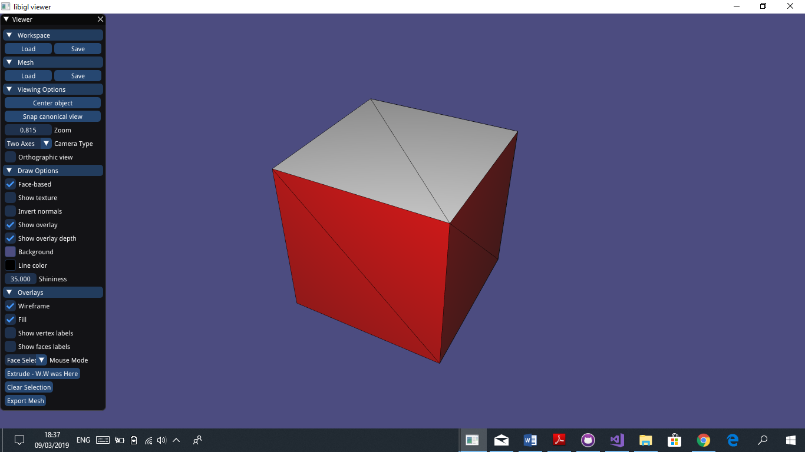

# Assignment 1

>Edit this 'README.md' file to report all your results. There is no need to write lengthy reports, just show the requested outputs and screenshots and quickly summarize your observations.   

## My Touch on the Interface
#### Notice the extrude Button (Not Walter White, Waseem Weshahi.)

## Required results

### Tasks

#### First Task
> 1) Add a text dump of the content of the two data structures for the provided mesh “cube.off”.

VF:

0 1 4 5 10

0 5 6 7

0 1 7 8 9

1 9 10 11

2 3 4 10 11

3 4 5 6

2 3 6 7 8

2 8 9 11

VV:

1 2 3 4 5

0 2 5 6

0 1 3 6 7

0 2 4 7

0 3 5 6 7

0 1 4 6

1 2 4 5 7

2 3 4 6

#### Second Task
> 2) Show screenshots of the provided meshes with each connected component colored differently. Show the number of connected components and the size of each component (measured in number
of faces) for all the provided models.

_There are 1 Compononet(s)
and their sizes (# of faces for each component) are as follows:_

_12_

	
_There are 2 Compononet(s)
and their sizes (# of faces for each component) are as follows:_

_3360    2304_

_There are 11 Compononet(s)
and their sizes (# of faces for each component) are as follows:_

_90      192     192     13216   704     1088    1088    1088    1088    736     736_

#### Third Task
> 3) Show screenshots of the subdivided meshes.

##### Cube before,after 1 step of subdivision and after 4 steps

  
   
  

##### Coffeecup before,after 1 step of subdivision and after 4 steps

  
   
  

#### Fourth Task
> 4) Show screenshots of face extrusion.

##### First Extrude:

##### Second Extrude:

#### Fifth Task
> 5) Show a screenshot of a mesh you designed yourself starting from 'cube.off' and using the GUI supplied editing operations, as well as sqrt3 subdivision and face extrusion. Make sure to also save the mesh under the name 'design.off', commit and push it. 

##### Tried to make a penguin but..
The Design can be found in /data/design.off

###### Before subdivisons

  
   

###### After subdivisons

  
   

