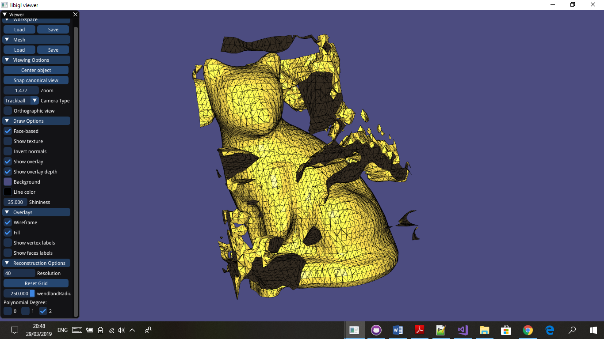
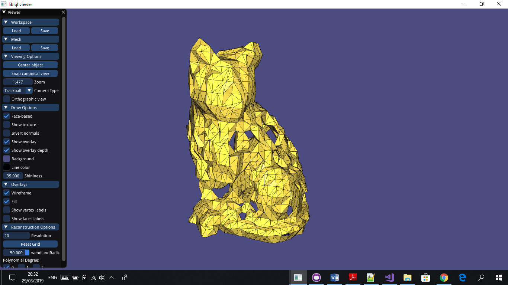
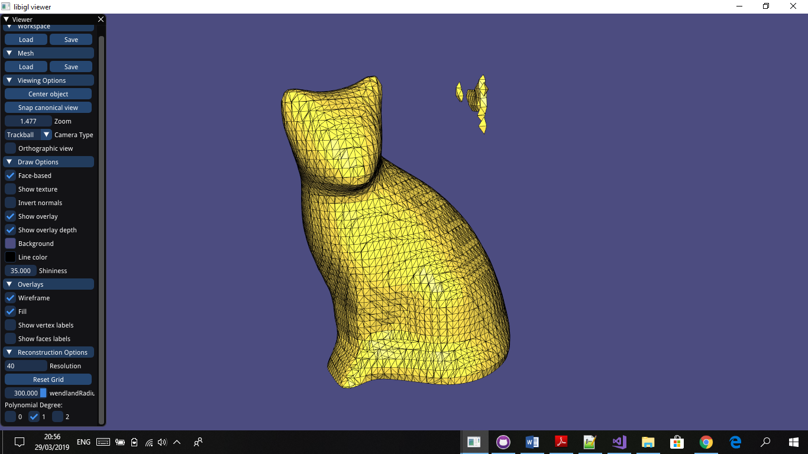
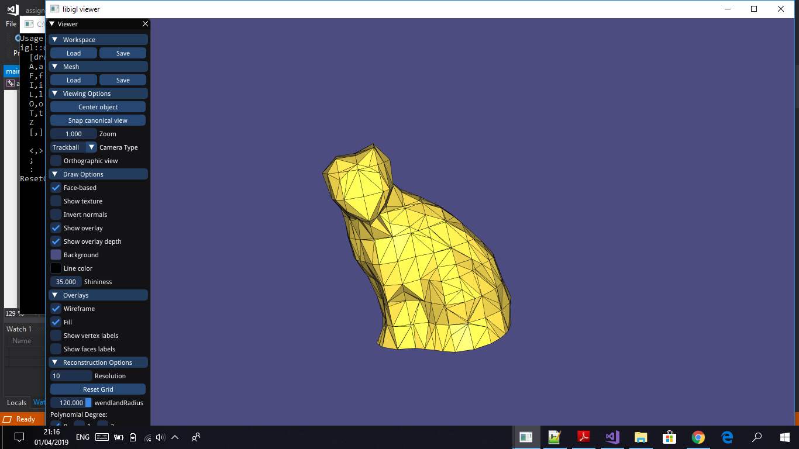

# Assignment 2

> Edit this 'README.md' file to report all your results. There is no need to write lengthy reports, just show the requested outputs and screenshots and quickly summarize your observations. Please add your additional files or notes in the folder 'assignment2/results' and refer to or directly show them in this page.

## Required results

### Mandatory Tasks
> 1) Show the visualization of the constrained points for the 'cat.off' point cloud.

> 2) Show screenshots of the grid with nodes colored according to their implicit function values (cat.off and luigi.off).

> 3) Show screenshots of the reconstructed surfaces. Experiment with different parameter settings: grid resolution (also anisotropic in the 3 axes), Wendland function radius, polynomial degree. Add all these settings to the GUI to ease experimentation. Briefly summarize your observations and save the reconstructed models in the off format for every point-cloud dataset provided (assignment2/results).

_In the following screenshots, you will mainly see the effect of the parameters with cat.off mesh since it is a generic mesh_

##### Polynomeial degree

###### The polynomeial degree was best at 0 and 1, but at the polynomeial degree of 2 it had mostly negative effect, for example in these screenshots we can see that when we have the a high polynomeial degree, it creates some sort of a wrapper effect, forming a body around the object

###### as for polynomial 0, it was mostly good but it had some holes that can not be repaired with changing other parameters, even for simple meshes like sphere.off

###### and as for polyDegree 1, while it didnt have holes , it did suffer from _some_ wrapper effect and extra-smoothing sometimes, acting like a nice middle ground, as seen in the following screenshots

##### wendlandRadius

###### wendlandRadius is proportional to the scale of the coordinates of the mesh's points, and choosing  a wendlandRadius too small can lead to weird uncontentious results like this

###### and choosing a radius that is too big can result in an an _overly_ smoothed surfaces 

##### Resolution

###### the higher the resolution the smoother the mesh gets, which means the cat loses its edges as its ear for example

###### and for a low resolution of course you get a very pointy cat with only prominent features appearing

##### Correctly chosen parameters

_In general,"good" meshes have either "noise" around the mesh (polyDeg=1) or some holes (polyDeg=0)_

4) Theory question: Save your notes to assignment2/results and add a link to this page.

[Theory Answer](results/TheoryQuestion.pdf)

### Optional Tasks

1) Save your notes and add a link to this page.

2) Show screenshots comparing the 'hound.off' of the normal based reconstruction to the point based reconstruction of the mandatory task.

3) Compare your MLS reconstruction results to the surfaces obtained with this method, and try to understand the differences. Report your findings.
