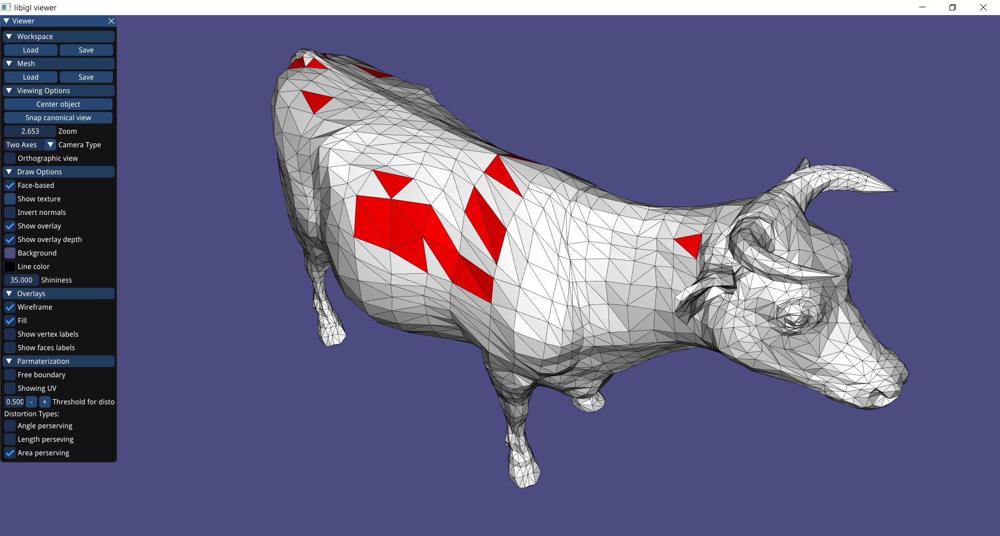

# Assignment 3

>Edit this 'README.md' file to report all your results. There is no need to write lengthy reports, just show the requested outputs and screenshots and quickly summarize your observations. Please add your additional files or notes in the folder 'assignment3/results' and refer to or directly show them in this page.

## Required results

>* Screenshots of the parameterizations and textured (checkerboard) models for all the implemented methods and boundary conditions (models: cathead.obj, hemisphere.off, hemisphere_non_convex_boundary.off,Octo_cut2.obj)

After implementing the 3 types of parameterization:

- Uniform
- Harmonic
- LSCM

And adding the free boundary option, which pins down the farthest two vertices, and maps the rest of the vertices accordingly.

The results were as follows:

The Uniform parameterization always had the worst result out of the three types,
for example we can see in the face.off how the squares are all mushed up.

_Uniform_ 

_Harmonic_

We can also observe how the LSCM without free boundary is unneccessiary because it yields to practically the same results as the Harmonic mapping, e.g:

_LSCM_ **NOT free boundary**
 

So from now on, when I say "LSCM parameterization" I only mean the LSCM with the free boundary.

_LSCM_

And as we have seen in class, shapes with non convex boundary, give us ugly results when we force fixed boundary on them, and I have got the chance to see that for myself:

_Uniform_ 

_Harmonic_

_LSCM_  

It is also intersting to see the "UV plate" of those parametrizations:

_Harmonic (same results were roughly obtained from the rest of fixed boundary paramateriations)_

_LSCM_

_*Notice How the triangles are all roughly similar and look like a uniform triangle, which is what we aspire to get in Paramaterizations!_

Other models worth the look:
###### Cow
_Uniform_ 

_Harmonic_

_LSCM_  

###### Cat
_Uniform_ 

_Harmonic_

_LSCM_  

###### Hemisphere
_Uniform_ 

_Harmonic_

_LSCM_  

> * Several examples of the distortion visualizations.

For the distortion visualizations, we extract the sigmas for each face, do some calculations with it (according 
to the type) and decide whether to paint it red or white according to a threshold that the user choses.

### Angle perserving distortion
_Uniform_ 

_Harmonic_

_LSCM_ **Fixed Boundary** 

_LSCM_  

### Length perserving distortion
_Uniform_ 

_Harmonic_

_LSCM_  

### Area perserving distortion
_Uniform_ 

_Harmonic_

_LSCM_  

