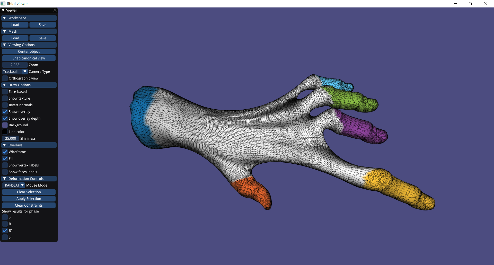

# Assignment 4

> Edit this 'README.md' file to report all your results. There is no need to write lengthy reports, just show the requested outputs and screenshots and quickly summarize your observations. Please add your additional files or notes in the folder 'assignment4/results' and refer to or directly show them in this page.

## Required results for assignment 4

### Mandatory Tasks

> Provide screenshots for 4 different deformed meshes. For each example, provide a rendering of S, B, B' and S'.

###### For each mesh, there will be four screesnhots corresponding to the four phases of the deformation rendering you can also look at the bottom left part in the menu panel to know which of the four phases this screenshot corresponds to

#### Bar

#### Bumpy Plane

#### Cactus

#### Camel head

#### Cylinder

#### Hand

#### woody (high)

#### woody (low)

### Optional Task

> Discuss and show the differences to the results from the previous task. 
